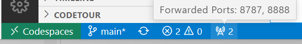
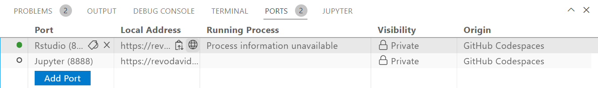

# Longevity-Risk-adjusted Global Age
Implementation of "Calibrating Gompertz in Reverse: What is Your Longevity-Risk-adjusted Global Age", By: Moshe A. Milevsky

# Prerequisite

- Install R and R studio
- Install the [packrat](https://rstudio.github.io/packrat/) library (`install.packages("packrat")`)
- Open Rstudio using the `Mosh-Book.Rproj` file
- Run `packrat::init()`
- Run `packrat::on()`

# github Codespace

Thanks to @revodavid https://github.com/revodavid/devcontainers-rstudio.git

If you have access to GitHub CodeSpaces, click the green "<> Code" button at the top right on this repository page, and then select "Create codespace on main". (GitHub CodeSpaces is available with [GitHub Enterprise](https://github.com/enterprise) and [GitHub Education](https://education.github.com/).)

To open RStudio Server, click the Forwarded Ports "Radio" icon at the bottom of the VS Code Online window.

In the Ports tab, click the Open in Browser "World" icon that appears when you hover in the "Local Address" column for the Rstudio row.

This will launch RStudio Server in a new window. Log in with the username and password `rstudio/rstudio`. 

* NOTE: Sometimes, the RStudio window may fail to open with a timeout error. If this happens, try again, or restart the Codepace.

For some unknown reason packrat doesn't work out-of-the-box under Codespace, you should use renv :

- Open the `Mosh-Book.Rproj` file
- Run `install.packages("renv")`
- Run `renv::activate()`
- Run `renv::snapshot()`
- Choose `2: Install the packages, then snapshot.`

# Get Original Data

After you have cloned the source-code from github, make sure to run `git lfs pull` (see [git-lfs](https://git-lfs.github.com/) for more detail).

# Folder Structure

## Scripts
- [00_method.R](scripts/00_method.R): the primary methods to compute the models in the paper
- [00_data](scripts/00_data): contains files that construct the data-set from the data extracted from the mortality database
    - [construct_dataset.R](scripts/00_data/construct_dataset.R): where the data from Human Mortality Databases is merged into a single table
- [01_analysis](scripts/01_analysis): all scripts that run analysis are located here.
    - [01_model_2011.R](scripts/01_analysis/01_model_2011.R): where the paper is implemented (note that each stage omits its own data-frame)
    - [01_model_historic.R](scripts/01_analysis/01_model_historic.R): where the stage1 model is implemented for all data from 1945 to 2011
- [02_display](scripts/02_display): any generation of custom latex or images can be found here
    - [00_methods.R](scripts/02_display/00_methods.R): generic display methods
    - [01_plots_2011.R](scripts/02_display/01_plots_2011.R): 2011 plots
    - [01_plots_historic.R](scripts/02_display/01_plots_historic.R): plots for the models from 1945 to 2011
    - [01_tables_2011.R](scripts/02_display/01_tables_2011.R): tables 1/2/3 in latex form
    - [01_tables_historic.R](scripts/02_display/01_tables_historic.R): historical tables from 1945 to 2011
- [03_errors](scripts/03_errors.R): error analysis plots
- [03_1st_reg_r2](scripts/03_1st_reg_r2.R): extraction of r2 values for first regression

## Data
- [00_raw](data/00_raw): this folders contain direct data from mortality.org, to replicate or update the data with an updated version of the same data see [construct_dataset.R](scripts/00_data/construct_dataset.R). 
    - [2011_qx_data.csv](data/00_raw/2011_qx_data.csv): the mortality tables for just the year 2011
    - [full_qx_data.csv](data/00_raw/full_qx_data.csv): all of the mortality tables for all of the available years in mortality.org
    - [country_codes.csv](data/00_raw/country_codes.csv): a manually generated list of the mortality.org country-codes to their respected names (this was created by hand, not through a script or from the original website).
- [01_models](data/02_models): the raw-results that each regression step generated are stored here, as well as the computation for LRAG-Age.
    - [historic-stage1.rds](data/02_models/historic-stage1.rds): the first round of regressions applied to all countries between 1945 to 2011
    - [stage1.rds](data/02_models/stage1.rds): the first round of regressions applied to all countries in 2011
    - [stage2.rds](data/02_models/stage2.rds): the second round of regressions applied to all countries in 2011
    - [stage3.rds](data/02_models/stage3.rds): the last computation where we compute LRAG-Age for all countries in 2011

